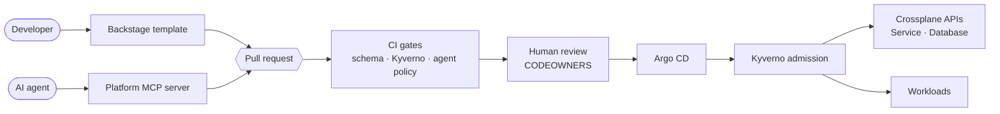

# aidp: from Internal Developer Platform to Agentic Developer Platform

A working, locally runnable platform that shows how I'd build an IDP for a
mid-sized engineering org, and then extend it so **AI agents become accountable
users of the platform alongside developers**, without building a second platform for them.

[](https://github.com/NicPucacco/aidp/actions/workflows/ci.yaml)

> **Short on time?** Read [the one idea](#the-one-idea), skim
> [the decisions table](#decisions-id-defend-in-an-interview), and look at the
> [roadmap](docs/roadmap.md). That covers most of it in about 5 minutes.

---

## The problem

[Fernhill Freight](docs/story.md) (fictional company, real problems) has 60 engineers, 14
services, and a 4-person platform team. Getting a database takes **five days**.
Services are deployed **fourteen different ways**. And since engineers started
using coding agents, plausible-looking but wrong infrastructure YAML has been
showing up in PRs, and **nobody can tell who, or what, wrote it.**

## The one idea

**The pull request is the platform API.** ([ADR-0001](docs/adr/0001-the-pull-request-is-the-platform-api.md))



Developers and agents reach the same contract through different front ends.
Neither has credentials that write to a cluster. Agents are *distinguished*
(their own identity, label, and stricter policy), not *separated* (no parallel
approval system). That's what makes the agentic layer thin: the IDP → ADP
transition adds an interface and some policy, not a second platform.

## Decisions I'd defend in an interview

| Decision | Why | ADR |
|---|---|---|
| Every change is a PR; nothing else writes to the cluster | One audit trail and one policy set for humans and agents | [0001](docs/adr/0001-the-pull-request-is-the-platform-api.md) |
| One repo, split by directory + CODEOWNERS | Right for a 4-person team. The ADR lists the signals that would justify splitting | [0002](docs/adr/0002-single-repository.md) |
| Terraform bootstraps Argo CD, then stops | Exactly one owner per resource; no Terraform/Argo drift fights | [0003](docs/adr/0003-terraform-bootstraps-argo-cd-owns-the-rest.md) |
| Target the Kubernetes API, not a distribution | Runs on kind, k3d, EKS, GKE… and lets CI test what reviewers run | [0004](docs/adr/0004-kubernetes-agnostic-local-first.md) |
| Same Kyverno policies in CI and at admission; enforcement is opt-in per namespace | Authors (human or agent) get feedback before review; legacy services aren't broken on day one | [0005](docs/adr/0005-kyverno-policies-run-in-ci-and-at-admission.md) |

More ADRs are added as each phase lands. Every ADR ends with **"What would
change my mind"**, because a decision with no exit criteria is just a preference.

## Stack

| Concern | Choice |
|---|---|
| Bootstrap | Terraform (Helm provider only) |
| GitOps | Argo CD (app-of-apps, ApplicationSets) |
| Platform APIs | Crossplane v2, composition functions in Python |
| Policy | Kyverno, the same policies run in CI and at admission |
| Ingress | Gateway API (Envoy Gateway) |
| Portal | Backstage |
| Agent interface | Python MCP server, PR-only GitHub App identity |
| CI | GitHub Actions, including a full bootstrap on kind for every PR |

## Run it

Requirements: Docker (~8 GB memory), kubectl, Terraform, kind. Run `make doctor` to check.

```bash
make up         # kind cluster + Terraform bootstrap, then waits for Argo CD to converge
make gateway    # Argo CD via the platform Gateway at http://argocd.localhost:8000
make password   # admin password
make test       # policy unit tests, then replay the same fixtures against the live cluster
make down       # tear it all down
```

Already have a cluster? Skip kind:

```bash
make platform KUBE_CONTEXT=my-context
```

## Repository map

```
bootstrap/    Day 0: Terraform that installs Argo CD on any cluster
platform/     Platform team: Argo apps, Crossplane APIs, Kyverno policies, charts
tenants/      Developers + agents: one directory per team and service (PR-only)
docs/         Story, roadmap, ADRs
.github/      CI, CODEOWNERS
```

## Following the evolution

Each phase is a git tag, and the [roadmap](docs/roadmap.md) explains the sequencing.
Running `git checkout v2-database-path && make up` gives you the platform as it was
at that point.
