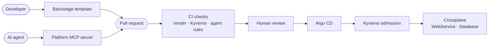

# aidp

[](https://github.com/NicPucacco/aidp/actions/workflows/ci.yaml)

This repo is an internal developer platform I built to show how I'd approach
one for a mid-sized engineering org, and what changes once AI coding agents
start using it alongside people.

It's set at a made-up company, [Fernhill Freight](docs/story.md): around 60
engineers, 14 services, and a platform team of four. They have the usual
problems. A new database means a ticket and about a week of waiting. Every
team deploys its services differently. More recently, coding agents have
started opening PRs full of Kubernetes YAML that looks right and often isn't,
and nobody can easily tell who, or what, wrote it.

## How it works

Every change goes through a pull request. Developers can open one from a
Backstage template, an agent can open one through the platform's MCP server,
or anyone can write the YAML by hand. All of them go through the same CI
checks and the same human review, and then Argo CD applies the change. No
person or agent has credentials that write to the cluster directly.



Teams don't write Deployments or Postgres manifests. They ask for a
`WebService` or a `Database`, about ten lines of YAML each, and Crossplane
turns that into the real resources with the platform's defaults: probes,
resource limits, non-root containers, a route on the shared gateway, a
database secret the service can reference. Kyverno checks the result in CI
and again at admission.

Agents go through exactly the same path. Their PRs come from a separate
GitHub App identity, the objects they create are annotated as agent-requested,
and a few extra limits apply to them, such as no large databases. Supporting
agents needed much less new machinery than I expected: an interface, one
policy and one CI job.

## Design decisions

Decisions are recorded as ADRs in [docs/adr](docs/adr). Each one covers the
context, the decision, the alternatives that were considered and why they
weren't chosen, the consequences, and the conditions under which it should be
revisited. ADRs aren't rewritten after the fact: when a decision changes, a
new ADR supersedes the old one, so the history of how the platform got here
stays readable.

| Area | ADRs |
|---|---|
| Workflow and repository | [0001](docs/adr/0001-the-pull-request-is-the-platform-api.md) pull requests as the platform API · [0002](docs/adr/0002-single-repository.md) single repository |
| Bootstrap and environments | [0003](docs/adr/0003-terraform-bootstraps-argo-cd-owns-the-rest.md) Terraform and Argo CD · [0004](docs/adr/0004-kubernetes-agnostic-local-first.md) Kubernetes-agnostic · [0016](docs/adr/0016-production-runs-on-aks.md) AKS · [0017](docs/adr/0017-ingress-per-environment.md) ingress per environment |
| Policy | [0005](docs/adr/0005-kyverno-policies-run-in-ci-and-at-admission.md) Kyverno in CI and at admission · [0009](docs/adr/0009-render-and-check-tenant-config-before-review.md) checking tenant changes before review |
| Platform APIs | [0006](docs/adr/0006-database-api-and-python-compositions.md) Database · [0008](docs/adr/0008-webservice-api.md) WebService · [0010](docs/adr/0010-platform-api-lifecycle.md) API lifecycle · [0014](docs/adr/0014-compositions-are-go-templates.md) Go-template compositions · [0015](docs/adr/0015-why-not-terraform-modules.md) why not Terraform modules |
| Tenants | [0007](docs/adr/0007-tenant-boundary.md) tenant boundary |
| Portal and access | [0011](docs/adr/0011-the-portal-is-a-thin-client.md) Backstage · [0018](docs/adr/0018-sso-without-secrets.md) sign-in |
| Agents | [0012](docs/adr/0012-agent-interface.md) agent interface · [0013](docs/adr/0013-agent-guardrails.md) agent guardrails |

## Stack

| | |
|---|---|
| GitOps | Argo CD, bootstrapped by Terraform |
| Platform APIs | Crossplane v2 with Go-template compositions |
| Policy | Kyverno |
| Ingress | Gateway API (Envoy Gateway), cert-manager on Azure |
| Databases | CloudNativePG |
| Portal | Backstage |
| Agents | A Python MCP server that can only open pull requests |
| Production | AKS, using the Azure Verified Module |
| CI | GitHub Actions, including a full install on kind for every PR |

## Running it locally

You'll need Docker, kubectl, Terraform and kind; `make doctor` checks for
them. Give Docker at least 4 CPUs and 12 GB of memory. The whole stack is a lot
of control plane for a single node: on an 8 GB Docker VM it was fine until I
added Backstage, after which etcd and the API server couldn't keep up. CI runs
the same setup on a standard GitHub runner for every PR, and it comes up in
about seven minutes.

```bash
make up         # create a kind cluster, install Argo CD, wait for the platform
make gateway    # port-forward the gateway; Argo CD is at http://argocd.localhost:8000
make password   # Argo CD admin password
make test       # unit tests, render and policy checks, then checks against the cluster
make down       # delete the cluster
```

Once it's up, Billing's service and its database are running from two short
files, [database.yaml](tenants/billing/invoice-api/database.yaml) and
[webservice.yaml](tenants/billing/invoice-api/webservice.yaml):

```bash
kubectl -n billing get databases,webservices
```

With `make gateway` running, the service is at http://invoice-api-billing.localhost:8000
and the portal at http://backstage.localhost:8000. The portal's templates can
open real PRs after `make portal-token`; without it you can still dry-run them.

To install onto a cluster you already have instead of kind:

```bash
make platform KUBE_CONTEXT=my-context
```

## Running on Azure

Production is meant to run on AKS. The Terraform for the cluster, its DNS
zone and static IP, and the Entra ID setup is in [terraform/](terraform/README.md).
I haven't applied it to a real subscription yet. It's validated and tested
offline against mocked providers, and CI renders the platform's charts in
their Azure configuration on every PR.

## Agents

Run `make agent-setup`, then open the repo in Claude Code or another MCP
client and ask for what you need in plain language. The agent can look up
teams, golden paths and API schemas, check its proposal, and open a PR as
`aidp-agent[bot]`. That PR then goes through the same checks and review as
any other. Without GitHub credentials it stops at a dry run.
[docs/agents.md](docs/agents.md) covers the setup and the guardrails.

## Repository layout

```
.
├── terraform/
│   ├── aks/                  AKS cluster, DNS zone, static IP, Entra ID apps
│   └── argocd/               installs Argo CD on any cluster, then stops
├── bootstrap/
│   └── kind/                 local cluster definition for `make up`
├── platform/                 everything Argo CD deploys
│   ├── apps/                 the app-of-apps: one Argo CD Application per component
│   ├── argocd/               Argo CD's own configuration
│   ├── apis/
│   │   ├── database/         Database API: XRD and composition
│   │   ├── webservice/       WebService API: XRD and composition
│   │   └── tests/            renders XRs through the real compositions
│   ├── policies/             Kyverno policies and their test fixtures
│   ├── gateway/              shared Gateway, TLS and platform routes
│   └── backstage/            deploys the portal
├── tenants/                  team-owned config, changed only by pull request
│   └── billing/
│       └── invoice-api/      a WebService and its Database
├── golden-paths/
│   ├── new-webservice/       Backstage template: new service, optional database
│   └── new-database/         Backstage template: standalone database
├── catalog/                  teams, the platform and its APIs, as Backstage entities
├── portal/                   the Backstage app (built into an image by CI)
├── agents/
│   └── platform-mcp/         MCP server agents use to discover and propose changes
├── scripts/                  CI checks and test helpers, also run by `make`
├── docs/
│   ├── adr/                  architecture decision records
│   ├── story.md              the Fernhill Freight scenario
│   ├── roadmap.md            phases and changes to the plan
│   └── agents.md             connecting an agent, and its guardrails
├── .github/                  CI workflow, CODEOWNERS, Dependabot
├── Makefile                  entry point for everything above
└── .mcp.json                 registers the platform MCP server for MCP clients
```

## History

The platform was built in phases, each tagged from `v0-foundations` to
`v5-agentic`, and later changes landed as pull requests that describe what
went wrong along the way. The [roadmap](docs/roadmap.md) explains the order.
To see the platform as it was at a particular point, check out a tag and run
`make up`, for example `git checkout v2-database-path && make up`.
