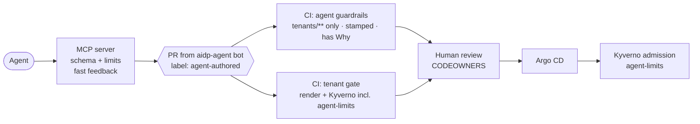

# Agents on the Fernhill platform

AI agents use the platform the same way developers do: they open pull
requests ([ADR-0001](adr/0001-the-pull-request-is-the-platform-api.md)).
This page covers how to connect one and how the guardrails work.

## Connect an agent

The platform is exposed as an [MCP](https://modelcontextprotocol.io) server
(`agents/platform-mcp`). Any MCP client can use it, and this repo's `.mcp.json`
registers it for Claude Code automatically.

```bash
make agent-setup   # creates agents/platform-mcp/.venv
```

Then open the repo in your MCP client and ask for something, e.g.
*"Billing needs a payment-reconciliation service with a small database."*

| Tool | Does |
|---|---|
| `list_teams`, `list_golden_paths`, `describe_api` | What exists and what can be requested (schemas come straight from the XRDs) |
| `search_catalog`, `list_team_resources` | What's already there |
| `propose_webservice`, `propose_database` | Render a golden path, validate it, and open a PR. **Dry run by default.** |
| `get_proposal_status` | CI checks and reviews on a proposal's PR, so the agent can iterate |

Without GitHub credentials the server still works. Proposals come back as
files, nothing is written, and reviewers can try it without any setup.

## Give the agent its own identity (GitHub App)

Agent PRs should come from an identity that is clearly *not* a person.

1. **Create the App:** GitHub → Settings → Developer settings → GitHub Apps → New.
   - Name: `aidp-agent` (PRs then show as `aidp-agent[bot]`, which CI recognises).
   - Webhook: off.
   - Repository permissions: **Contents: Read & write**, **Pull requests: Read & write**,
     **Issues: Read & write** (for labels), **Checks: Read**. Nothing else.
2. **Install it** on this repository only.
3. **Generate a private key**, and note the App ID and installation ID.
4. Export them before starting your MCP client:

   ```bash
   export GITHUB_APP_ID=...
   export GITHUB_APP_INSTALLATION_ID=...
   export GITHUB_APP_PRIVATE_KEY_PATH=~/.config/aidp-agent.pem
   ```

The server mints a short-lived installation token per PR, scoped further to
contents, pull requests and issues (write) and checks (read) on this one repo. `GITHUB_TOKEN` also
works for development, but PRs then appear as you, and only the label and
annotations mark them as agent-authored.

**Required:** branch protection on `main` (PR required, CODEOWNER review,
required status checks). Contents write access lets the App push branches.
Branch protection is what stops it from changing `main`.

## Guardrails, from the agent inwards



| Layer | Stops | Bypassable by a misbehaving agent? |
|---|---|---|
| MCP server checks | Mistakes, early: bad schema, `:latest`, `large`, too many replicas | Yes. It's UX, not a control |
| CI: agent guardrails | Agent PRs touching anything outside `tenants/**`, unstamped objects, no reason given | Only by hiding that it's an agent; the bot identity prevents that |
| CI: tenant gate | Anything that won't compose or breaks policy, including agent limits | No |
| Human review | Requests that are valid but shouldn't happen | No: agents can't approve |
| Admission (Kyverno) | Agent-stamped objects over the limits, even if CI was bypassed | No |

Agent limits today: size at most `medium`, at most 3 replicas, new resources
only. A human can still open the same request. See
[ADR-0013](adr/0013-agent-guardrails.md) for why limits are by *who asked*,
not by *what's asked*.
